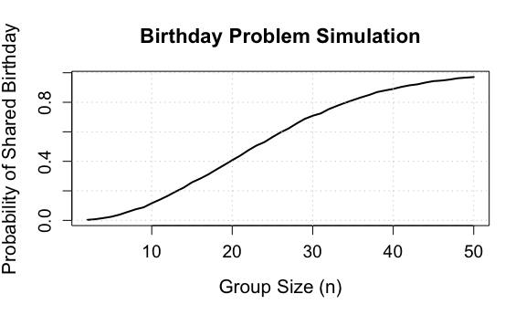
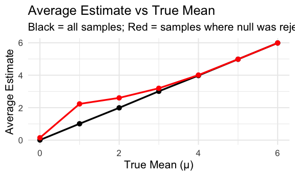

HW5
================
Yuwei Ma

## Problem 1

``` r
library(tidyverse)
library(dplyr)
library(ggplot2)
library(broom)

knitr::opts_chunk$set(
  fig.width = 6,
  fig.asp = .6,
  out.width = "90%"
)
```

Build function

``` r
# Function to test whether a group has at least one shared birthday

birthday_dup <- function(n) {
birthdays <- sample(1:365, n, replace = TRUE)
any(duplicated(birthdays))
}
```

Simulation

``` r
set.seed(123)  # ensures reproducibility

group_sizes <- 2:50
num_runs <- 10000

prob_shared <- numeric(length(group_sizes))

for (i in seq_along(group_sizes)) {
n <- group_sizes[i]
results <- replicate(num_runs, birthday_dup(n))
prob_shared[i] <- mean(results)
}

prob_shared
```

    ##  [1] 0.0033 0.0079 0.0158 0.0248 0.0387 0.0570 0.0749 0.0885 0.1160 0.1402
    ## [11] 0.1665 0.1958 0.2228 0.2578 0.2824 0.3105 0.3434 0.3750 0.4079 0.4388
    ## [21] 0.4747 0.5067 0.5301 0.5644 0.5958 0.6226 0.6564 0.6871 0.7088 0.7246
    ## [31] 0.7537 0.7753 0.7959 0.8147 0.8331 0.8494 0.8693 0.8803 0.8905 0.9040
    ## [41] 0.9146 0.9216 0.9335 0.9434 0.9471 0.9537 0.9627 0.9669 0.9710

Plot

``` r
plot(group_sizes, prob_shared, type = "l", lwd = 2,
xlab = "Group Size (n)",
ylab = "Probability of Shared Birthday",
main = "Birthday Problem Simulation",
cex.lab = 1.3, cex.axis = 1.2, cex.main = 1.4)

grid()
```



The simulation shows:

- The probability rises slowly for small groups, but increases rapidly
  after around 20 people.
- At 23 people, the probability of a shared birthday is close to 50%.
- By the time the group reaches 50 people, the probability is above 90%.

This result is counterintuitive because we expect that a much larger
group is needed for such a high probability. The paradox arises because
we compare all possible pairs within the group, and the number of pairs
grows quadratically with group size.

## Problem 2

``` r
simulate_test <- function(mu, sigma = 5, n = 30) {
x <- rnorm(n, mean = mu, sd = sigma)
result <- tidy(t.test(x, mu = 0))

tibble(
estimate = result$estimate,
pvalue = result$p.value
)
}
```

simulation

``` r
set.seed(123)

mu_values <- 0:6
num_sims <- 5000

results <- lapply(mu_values, function(mu) {
sims <- replicate(num_sims, simulate_test(mu), simplify = FALSE)
df <- bind_rows(sims)
df$mu_true <- mu
df
})

results <- bind_rows(results)
```

plot1: Power vs True μ

``` r
power_df <- results %>%
group_by(mu_true) %>%
summarize(power = mean(pvalue < 0.05))

ggplot(power_df, aes(x = mu_true, y = power)) +
geom_line(linewidth = 1.2) +
geom_point(size = 3) +
labs(title = "Power vs True Mean",
x = "True Mean (μ)",
y = "Power (Pr(reject H0))") +
theme_minimal(base_size = 16)
```


Power increases as the true mean μ gets farther from 0. When μ=0, the
test rarely rejects (close to 5%, the nominal level). As μ increases to
6, power quickly approaches 1. This occurs because larger effect sizes
produce sample means more easily distinguished from 0.

plot2

``` r
estimate_df <- results %>%
group_by(mu_true) %>%
summarize(
avg_estimate_all = mean(estimate),
avg_estimate_rej = mean(estimate[pvalue < 0.05])
)
estimate_df
```

    ## # A tibble: 7 × 3
    ##   mu_true avg_estimate_all avg_estimate_rej
    ##     <int>            <dbl>            <dbl>
    ## 1       0          0.00900            0.147
    ## 2       1          1.01               2.23 
    ## 3       2          1.99               2.60 
    ## 4       3          3.01               3.20 
    ## 5       4          3.98               4.01 
    ## 6       5          4.98               4.99 
    ## 7       6          5.99               5.99

``` r
ggplot(estimate_df, aes(x = mu_true)) +
geom_line(aes(y = avg_estimate_all), linewidth = 1.2) +
geom_point(aes(y = avg_estimate_all), size = 3) +
geom_line(aes(y = avg_estimate_rej), color = "red", linewidth = 1.2) +
geom_point(aes(y = avg_estimate_rej), color = "red", size = 3) +
labs(title = "Average Estimate vs True Mean",
x = "True Mean (μ)",
y = "Average Estimate",
subtitle = "Black = all samples; Red = samples where null was rejected") +
theme_minimal(base_size = 16)
```



- The black line (all samples) lies almost exactly on the 45° line → the
  estimator is unbiased, as expected for the sample mean.
- The red line (only samples that rejected H0) is systematically above
  the true μ for small effect sizes.

This happens because:

- When the true μ is small (e.g., 0–2), the null is rejected only when
  the sample mean happens to be unusually large.
- Conditioning on rejection introduces selection bias.
- Therefore, the average estimate among significant results
  overestimates the true mean. This is known as the winner’s curse or
  significance filter bias.
