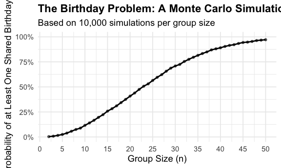
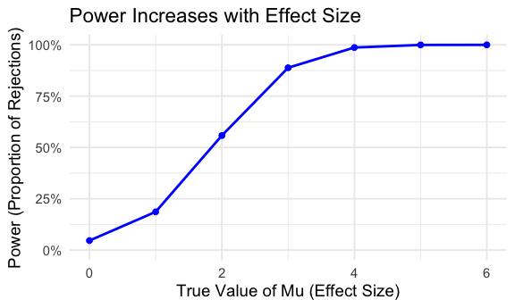
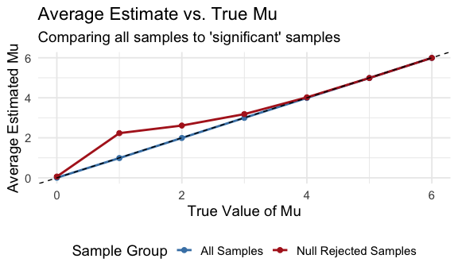
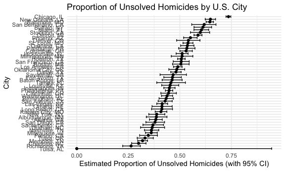

HW5
================
Yuwei Ma

``` r
library(tidyverse)
library(dplyr)
library(ggplot2)
library(broom)
library(knitr)
knitr::opts_chunk$set(
  fig.width = 6,
  fig.asp = .6,
  out.width = "90%"
)
```

## Problem 1

Build function

``` r
has_duplicate_birthday <- function(n) {
  birthdays <- sample(1:365, size = n, replace = TRUE)
  has_duplicate <- length(unique(birthdays)) < n

  return(has_duplicate)
}
```

Simulation

``` r
set.seed(123)

n_sims <- 10000
group_sizes <- 2:50

simulation_df <- tibble(group_size = group_sizes)

prob_data <- simulation_df |> 
  rowwise() |> 
  mutate(
    probability = mean(replicate(n_sims, has_duplicate_birthday(group_size)))
  ) |> 
  ungroup() # Always ungroup after rowwise()

print(head(prob_data))
```

    ## # A tibble: 6 × 2
    ##   group_size probability
    ##        <int>       <dbl>
    ## 1          2      0.0033
    ## 2          3      0.0079
    ## 3          4      0.0158
    ## 4          5      0.0248
    ## 5          6      0.0387
    ## 6          7      0.057

Plot

``` r
prob_data |> 
  ggplot(aes(x = group_size, y = probability)) +
  geom_line(size = 1) +
  geom_point(alpha = 0.6) +
labs(
    title = "The Birthday Problem: A Monte Carlo Simulation",
    subtitle = paste("Based on", scales::comma(n_sims), "simulations per group size"),
    x = "Group Size (n)",
    y = "Probability of at Least One Shared Birthday"
  ) +
  # Format the y-axis as percentages (0%, 25%, etc.)
  scale_y_continuous(labels = scales::percent, limits = c(0, 1)) +
  
  # Set the x-axis to show breaks every 5 people
  scale_x_continuous(breaks = seq(0, 50, 5)) +
  # Use a clean, minimal theme
  theme_minimal(base_size = 14) +
  theme(plot.title = element_text(face = "bold"))
```



The simulation shows:

- The probability rises slowly for small groups, but increases rapidly
  after around 20 people.
- At 23 people, the probability of a shared birthday is close to 50%.
- By the time the group reaches 50 people, the probability is above 90%.

## Problem 2

simulation

``` r
n <- 30
sigma <- 5
mu_values <- 0:6
n_sims <- 5000
alpha <- 0.05

# Create a grid of all simulation runs
sim_grid <- crossing(
  mu = mu_values,
  sim_num = 1:n_sims
)
```

simulation

``` r
all_results <- sim_grid |> 
  mutate(
    test_result = map(mu, ~ tidy(t.test(rnorm(n = n, mean = .x, sd = sigma), mu = 0)))
  ) |> 
  unnest(test_result)
```

``` r
# Calculate power for each true value of mu
power_data <- all_results |> 
  group_by(mu) |> 
  summarize(
    power = mean(p.value < alpha),
    .groups = "drop"
  )

# Power table
knitr::kable(
  power_data,
  digits = 3,
  col.names = c("True Mu (Effect Size)", "Power"),
  caption = "Power vs. True Effect Size"
)
```

| True Mu (Effect Size) | Power |
|----------------------:|------:|
|                     0 | 0.046 |
|                     1 | 0.186 |
|                     2 | 0.558 |
|                     3 | 0.888 |
|                     4 | 0.987 |
|                     5 | 1.000 |
|                     6 | 1.000 |

Power vs. True Effect Size

``` r
# Power Plot
ggplot(power_data, aes(x = mu, y = power)) +
  geom_line(color = "blue", size = 1) +
  geom_point(color = "blue", size = 2) +
  scale_y_continuous(limits = c(0, 1), labels = scales::percent_format()) +
  labs(
    title = "Power Increases with Effect Size",
    x = "True Value of Mu (Effect Size)",
    y = "Power (Proportion of Rejections)"
  ) +
  theme_minimal(base_size = 14)
```



As shown in the plot and table, there is a strong, positive association
between effect size and power.

When the true $\mu = 0$ (i.e., the null hypothesis is true), the
proportion of rejections is approximately 0.05. This is our significance
level, $\alpha$, and represents the Type I error rate.

As the true $\mu$ increases from 1 to 6, the power (the probability of
correctly rejecting the false null hypothesis) increases monotonically
from about 18% to nearly 100%.

This demonstrates that it is much easier to detect a large effect (e.g.,
$\mu = 6$) than a small effect (e.g., $\mu = 1$) with the same sample
size and variance.

Plot 2

``` r
estimate_data <- all_results |> 
  group_by(mu) |> 
  summarize(
    # Average estimate across ALL samples
    avg_estimate_all = mean(estimate),
    
    # Average estimate ONLY in samples where H0 was rejected
    # We filter for p.value < alpha before taking the mean
    avg_estimate_rejected = mean(estimate[p.value < alpha]),
    .groups = "drop"
  )

# Pivot to long format for easy plotting with ggplot
estimate_data_long <- estimate_data |> 
  pivot_longer(
    cols = c(avg_estimate_all, avg_estimate_rejected),
    names_to = "sample_group",
    values_to = "average_estimate"
  )


ggplot(estimate_data_long, aes(x = mu, y = average_estimate, color = sample_group)) +
  geom_line(size = 1) +
  geom_point(size = 2) +
  # Add a y=x line to show the "perfect" estimate
  geom_abline(
    slope = 1, intercept = 0,
    linetype = "dashed", color = "black"
  ) +
  scale_color_manual(
    name = "Sample Group",
    values = c("avg_estimate_all" = "steelblue", "avg_estimate_rejected" = "firebrick"),
    labels = c("All Samples", "Null Rejected Samples")
  ) +
  labs(
    title = "Average Estimate vs. True Mu",
    subtitle = "Comparing all samples to 'significant' samples",
    x = "True Value of Mu",
    y = "Average Estimated Mu"
  ) +
  theme_minimal(base_size = 14) +
  theme(legend.position = "bottom")
```



The sample average of $\mu$ across tests for which the null is rejected
is not approximately equal to the true value of $\mu$.

Unbiased Estimator (All Samples): The plot shows that the average
estimate across all samples (the blue line) falls almost perfectly on
the dashed y=x line. This confirms that the sample mean (estimate) is an
unbiased estimator of the true $\mu$.

Biased Estimator (Rejected Samples): The average estimate from only the
‘significant’ samples (the red line) is consistently higher than the
true value of $\mu$.

This is because of selection bias. We are filtering our results based on
a statistical test. When the true effect size is small (e.g., $\mu = 1$
or $\mu = 2$), power is low. The only way to get a “significant” result
in this low-power setting is if the random sample, by chance, produces a
sample mean that is substantially larger than the true mean. When we
average only these “winning” samples that were lucky enough to pass the
significance threshold, the resulting average is artificially inflated.

As power gets higher (e.g., $\mu = 5$ or $\mu = 6$), almost all samples
lead to rejection, so this selection bias diminishes, and the red line
converges with the blue line and the true value.

## Problem 3

``` r
homicide_df = read_csv("data/homicide-data.csv")
```

    ## Rows: 52179 Columns: 12
    ## ── Column specification ────────────────────────────────────────────────────────
    ## Delimiter: ","
    ## chr (9): uid, victim_last, victim_first, victim_race, victim_age, victim_sex...
    ## dbl (3): reported_date, lat, lon
    ## 
    ## ℹ Use `spec()` to retrieve the full column specification for this data.
    ## ℹ Specify the column types or set `show_col_types = FALSE` to quiet this message.

- The dataset includes homicide-level information in 50 major U.S.
  cities.
- It contains 52179 observations and 12 variables.
- It includes:
  - Victim information: race, age, sex
  - Location: city, state, latitude/longitude
  - Date of report
  - Case disposition
  - Unique case ID
- Each row corresponds to one homicide case.

# Summarize the data

``` r
# Create city_state and summarize
city_summary <- homicide_df |> 
  mutate(city_state = str_c(city, ", ", state)) |> 
  group_by(city_state) |> 
  summarize(
    total_homicides = n(),
    unsolved_homicides = sum(disposition %in% c("Closed without arrest", "Open/No arrest"))
  )

knitr::kable(city_summary)
```

| city_state         | total_homicides | unsolved_homicides |
|:-------------------|----------------:|-------------------:|
| Albuquerque, NM    |             378 |                146 |
| Atlanta, GA        |             973 |                373 |
| Baltimore, MD      |            2827 |               1825 |
| Baton Rouge, LA    |             424 |                196 |
| Birmingham, AL     |             800 |                347 |
| Boston, MA         |             614 |                310 |
| Buffalo, NY        |             521 |                319 |
| Charlotte, NC      |             687 |                206 |
| Chicago, IL        |            5535 |               4073 |
| Cincinnati, OH     |             694 |                309 |
| Columbus, OH       |            1084 |                575 |
| Dallas, TX         |            1567 |                754 |
| Denver, CO         |             312 |                169 |
| Detroit, MI        |            2519 |               1482 |
| Durham, NC         |             276 |                101 |
| Fort Worth, TX     |             549 |                255 |
| Fresno, CA         |             487 |                169 |
| Houston, TX        |            2942 |               1493 |
| Indianapolis, IN   |            1322 |                594 |
| Jacksonville, FL   |            1168 |                597 |
| Kansas City, MO    |            1190 |                486 |
| Las Vegas, NV      |            1381 |                572 |
| Long Beach, CA     |             378 |                156 |
| Los Angeles, CA    |            2257 |               1106 |
| Louisville, KY     |             576 |                261 |
| Memphis, TN        |            1514 |                483 |
| Miami, FL          |             744 |                450 |
| Milwaukee, wI      |            1115 |                403 |
| Minneapolis, MN    |             366 |                187 |
| Nashville, TN      |             767 |                278 |
| New Orleans, LA    |            1434 |                930 |
| New York, NY       |             627 |                243 |
| Oakland, CA        |             947 |                508 |
| Oklahoma City, OK  |             672 |                326 |
| Omaha, NE          |             409 |                169 |
| Philadelphia, PA   |            3037 |               1360 |
| Phoenix, AZ        |             914 |                504 |
| Pittsburgh, PA     |             631 |                337 |
| Richmond, VA       |             429 |                113 |
| Sacramento, CA     |             376 |                139 |
| San Antonio, TX    |             833 |                357 |
| San Bernardino, CA |             275 |                170 |
| San Diego, CA      |             461 |                175 |
| San Francisco, CA  |             663 |                336 |
| Savannah, GA       |             246 |                115 |
| St. Louis, MO      |            1677 |                905 |
| Stockton, CA       |             444 |                266 |
| Tampa, FL          |             208 |                 95 |
| Tulsa, AL          |               1 |                  0 |
| Tulsa, OK          |             583 |                193 |
| Washington, DC     |            1345 |                589 |

# Baltimore

``` r
# Filter for Baltimore data
baltimore_data <- city_summary |> 
  filter(city_state == "Baltimore, MD")

# Run prop.test for Baltimore
balt_prop <- prop.test(
  x = baltimore_data$unsolved_homicides,
  n = baltimore_data$total_homicides
)

# Tidy the result
balt_tidy = balt_prop |> 
  broom::tidy()

balt_table = balt_tidy |> 
  select(estimate, p.value, conf.low, conf.high) 

knitr::kable(balt_table)
```

|  estimate | p.value |  conf.low | conf.high |
|----------:|--------:|----------:|----------:|
| 0.6455607 |       0 | 0.6275625 | 0.6631599 |

The estimated proportion is 0.6455607; the 95% confidence interval is
(0.6275625, 0.6631599).

# All cities

``` r
# Run prop.test for all cities and tidy the results
city_props <- city_summary |> 
  mutate(
    prop_test = map2(unsolved_homicides, total_homicides, ~ prop.test(x = .x, n = .y)),
    tidy_test = map(prop_test, broom::tidy)
  ) |> 
  unnest(tidy_test) |> 
  select(city_state, total_homicides, unsolved_homicides, estimate, conf.low, conf.high)

# View the results
knitr::kable(head(city_props))
```

| city_state | total_homicides | unsolved_homicides | estimate | conf.low | conf.high |
|:---|---:|---:|---:|---:|---:|
| Albuquerque, NM | 378 | 146 | 0.3862434 | 0.3372604 | 0.4375766 |
| Atlanta, GA | 973 | 373 | 0.3833505 | 0.3528119 | 0.4148219 |
| Baltimore, MD | 2827 | 1825 | 0.6455607 | 0.6275625 | 0.6631599 |
| Baton Rouge, LA | 424 | 196 | 0.4622642 | 0.4141987 | 0.5110240 |
| Birmingham, AL | 800 | 347 | 0.4337500 | 0.3991889 | 0.4689557 |
| Boston, MA | 614 | 310 | 0.5048860 | 0.4646219 | 0.5450881 |

``` r
# Create the plot
city_props |> 
  ggplot(aes(x = fct_reorder(city_state, estimate), y = estimate)) +
  geom_point() +
  geom_errorbar(aes(ymin = conf.low, ymax = conf.high)) +
  coord_flip() +
  labs(
    title = "Proportion of Unsolved Homicides by U.S. City",
    x = "City",
    y = "Estimated Proportion of Unsolved Homicides (with 95% CI)"
  ) +
  theme_minimal()
```


